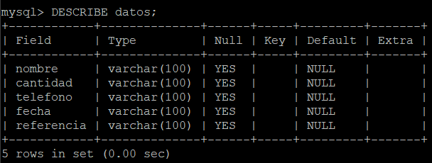
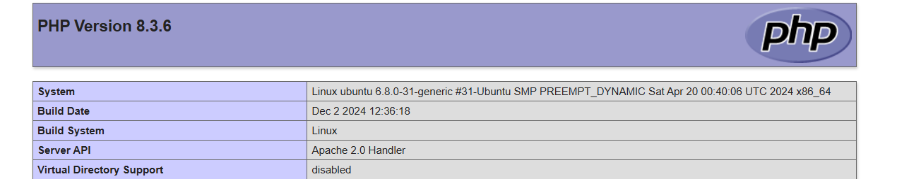

# create_database_on_my_vps
<h1 align="center">Julian Arley Paez Silva</h1><br>

This repository show how you can create a database in your vps with mysql ubuntu and apache

<h1>first step</h1>

install mysql in your vps if you yet dont have 

```bash
sudo apt install mysql-server
```
now enter to mysql with this command

```bash
mysql -u root -p
```
the password is the same of your vps 

now you need create your first database with the next steps


first step
```
CREATE DATABASE primer_database;
```
second step 
```
USE primer_database;
```
third step
```
CREATE TABLE mi_tabla (
    nombre VARCHAR(100),
    cantidad VARCHAR(100),
    telefono VARCHAR(100), 
    fecha VARCHAR(100),
    referencia VARCHAR(100)
    );
```
use this command to see how look your table

```
DESCRIBE mi_tabla;
```



<h2>creacion del archivo PHP</h2>

vamos a crear un archivo php que se va a encaragar de ser el intermediario entre la base de datos 
y nuestra aplicacion, pagina web etc

<h3>descarga php en tu vps</h3>

actualiza los paquetes del sistema
```
sudo apt update
sudo apt upgrade -y
```
instala php y el modulo apache para el sistema
```
sudo apt install php libapache2-mod-php -y
```
reinicia apache para guardar los cambios
```
sudo systemctl restart apache2
```
con este comando puedes ver la version php que tienes en el sistema 

```
php -v
```

vamos a crear un archivo de prueba 
```
sudo nano /var/www/html/info.php
```

```php
<?php
phpinfo();
?>
```
recuerda siempre reiniciar apache para guardar los cambios 

ahora ve a navegador escribe el nombre de tu ip o dominio seguido del nombre del archivo php
ejemplo "76.209.45.47/info.php"
debera arrojar algo asi 



una vez ya hallamos confirmado que esta bien instalado php vamos a proceder a crear el archivo que se conectara a la base de datos 

```
sudo nano /var/www/html/conexion.php
```

```

<?php

$host = "localhost";
$usuario = "nombre_de_usuario";
$password =  "contraseña";
$bd = "nombre_de_la_base_de_datos";


try {
    $conexion = new PDO("mysql:host=$host;dbname=$bd;charset=utf8", $usuario, $password);
    // Configurar PDO para que lance excepciones en caso de error
    $conexion->setAttribute(PDO::ATTR_ERRMODE, PDO::ERRMODE_EXCEPTION);
    echo "¡Conexión exitosa a la base de datos!";
} catch (PDOException $e) {
    // Mostrar mensaje de error si la conexión falla
    echo "Error al conectar a la base de datos: " . $e->getMessage();
}
?>
```


